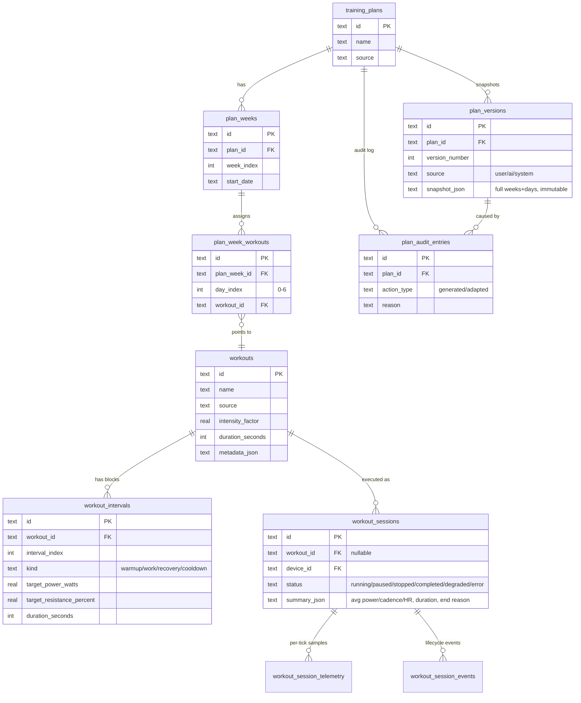
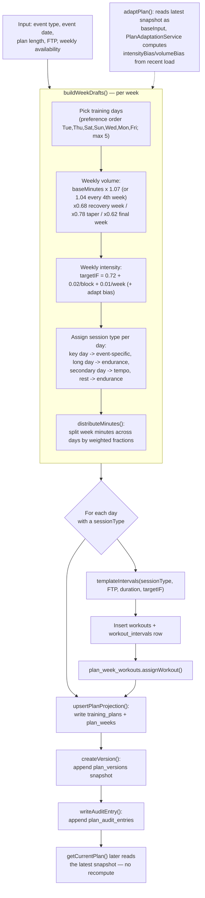

# Training plans & workout generation

How workouts and training plans are structured in the database, and the formula
Full Send uses to turn an event goal into a week-by-week plan.

## Data model

A **workout** is a reusable template (warmup/work/recovery/cooldown blocks). A
**workout session** is one logged execution of a workout on the trainer. A
**training plan** assigns workouts to specific days across several weeks.

Source: `src/main/database/schema.ts`.

### Workouts vs. sessions

`workouts` / `workout_intervals` are the *plan* — they don't change once a ride
starts. `workout_sessions` is the *log* of one attempt at riding a workout
(`workout_id` is nullable, so freeform sessions are allowed). Per-second power,
cadence, and heart-rate samples land in `workout_session_telemetry`; lifecycle
events (start/pause/resume/finalize/tick-drift/etc.) land in
`workout_session_events`. When a session ends, the rider chooses to discard it
(all three rows are deleted) or save it, which computes average power/cadence/HR
from `workout_session_telemetry` and writes them into `workout_sessions.summary_json`
with `status = 'completed'`.

## How a `workouts` row gets created

Two independent paths write to the same `workouts` / `workout_intervals` tables:

1. **Manual, via the workout builder UI** — `WorkoutLibraryService.createWorkout()`
   (`src/main/workout/WorkoutLibraryService.ts`), exposed over IPC as
   `workoutLibrary.createWorkout`. Intervals come directly from what the user
   built; `metadata_json` is tagged `{"authoredManually": true}`.
2. **Auto-generated by the plan generator** — `EventPlanService`
   (`src/main/plans/EventPlanService.ts`), one `workouts` row per scheduled day,
   tagged `source: "event-plan-generator"` with metadata linking back to
   `{planId, weekIndex, dayIndex, sessionType}`.

## Are training plans saved, or regenerated on the fly?

**Saved — nothing is recomputed on read.** `generatePlan()` / `adaptPlan()` each
run in one DB transaction that persists a `training_plans` row, `plan_weeks`
rows, the generated `workouts`/`workout_intervals`, and `plan_week_workouts`
links. Critically, every generate/adapt call also appends a new
`plan_versions` row holding a full JSON snapshot of every week/day
(`snapshot_json`) — versions are never overwritten, only appended, alongside a
`plan_audit_entries` row recording who/why. Reading the current plan
(`getCurrentPlan()`) just deserializes the latest version's snapshot; adapting
a plan starts from that stored snapshot as its base input, not from a fresh
computation.

## The generation formula

Plan generation is deterministic, rule-based periodization — no ML. It has two
layers: **weekly periodization** (how much, how hard, which days) and a
**per-session template** (what the interval shape looks like).

Source: `EventPlanService.buildWeekDrafts()` and `templateIntervals()` in
`src/main/plans/EventPlanService.ts`.

### Weekly periodization details

- **Base volume**: `baseMinutes = clamp(150 + sessionsPerWeek * 35, 150, weeklyMaxMinutes)`.
- **Progression**: each build week grows volume by **7%** (or **4%** every 4th
  week, a lighter step). Every 4th week is a recovery week
  (`(weekIndex+1) % 4 === 0`), cut to **68%** of that week's volume. The final
  two weeks are taper, cut to **78%** (**62%** for the very last week).
- **Intensity**: `targetIF = 0.72 + floor(weekIndex/4)*0.02 + (weekIndex%4)*0.01`,
  clamped to `[0.55, 0.9]`; recovery weeks get `-0.08`, taper weeks `-0.05`.
- **Adaptation bias**: `adaptPlan()` runs `PlanAdaptationService.adapt()` first,
  which derives `intensityBias`/`volumeBias` from how recent weeks actually
  went, then feeds those biases straight into the two formulas above.
- **Day roles**: one **key day** (Tue/Wed/Thu) takes the event-specific session
  type at boosted IF (`+0.05` for vo2, `+0.03` otherwise); one **long day**
  (Sat/Sun) takes endurance at `~90%` of week IF; a **secondary day** takes
  tempo; everything else defaults to endurance.
- **Minute allocation**: `distributeMinutes()` splits the week's target minutes
  across the chosen days using fixed weighting tables by day-count (e.g. 3
  days → `26% / 28% / 46%`, weighting the long day heaviest), then nudges
  values to hit the target exactly within each day's `maxDurationMin`.

### Interval templates (`templateIntervals()`)

For every session, `warmup = clamp(round(duration*0.15), 5, 10)` min,
`cooldown = clamp(round(duration*0.10), 4, 8)` min, and
`watts(mult) = round(FTP * mult)`:

| Session type | Shape |
|---|---|
| `recovery` | warmup@45% → work@55% → cooldown@45% |
| `endurance` | warmup@55% → work@`targetIF` → cooldown@50% |
| `tempo` | warmup@55% → work@`targetIF` → recovery@60% → work@`targetIF` → cooldown@50% |
| `threshold` | warmup@60% → 3×(work@`clamp(targetIF,0.9,1.0)` + 4-min recovery@55%) → cooldown@50% |
| `vo2` | warmup@60% → 4-6×(3-min work@**108%** + 3-min recovery@50%) → cooldown@50% |

`sessionType` picks the shape; FTP sets the absolute watts; `targetIF` (from
the weekly periodization above) sets how hard the main work block is relative
to FTP.
